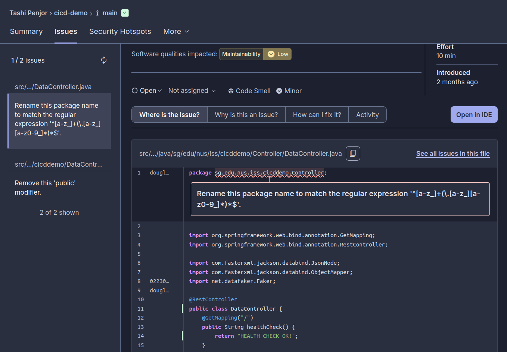

# PRACTICAL 4: Integrating Sonarcloud With GITHUB ACTIONS 

The report documents the successful implementation of Static Application Security Testing (SAST) using SonarCloud integrated with GitHub Actions for the cicd-demo.

## key Achievements:

- SonarCloud account created and configured
- GitHub Actions workflow automated
- Security analysis completed
- Quality gate enforced
- Continuous monitoring implemented

## GitHub Actions Workflow

Key Features:

- Triggered on push to master/main
- Triggered on pull requests
- JDK 17 setup
- Maven caching enabled
- SonarCloud analysis included
- Quality gate wait enabled

Workflow Triggers:

- Push to master/main branches
- Pull requests (opened, synchronize, reopened)

## SONARCLOUD ANALYSIS RESULTS

The sonarcloud shows all the test passed. 

## Security Analysis Findings

Issue 1: Package Naming Convention Violation (Maintainability)
- Package name does not follow Java naming conventions. Java convention
dictates that package names must be all lowercase and follow the regular
expression pattern.

Renamed the package using lowercase. 

Issue 2: Unnecessary Public Modifier on Test Class
- Test class has an unnecessary "public" modifier. According to Java testing best practices and conventions, test classes should be package-private (no access modifier specified).

removed the public key from the class declaration.

